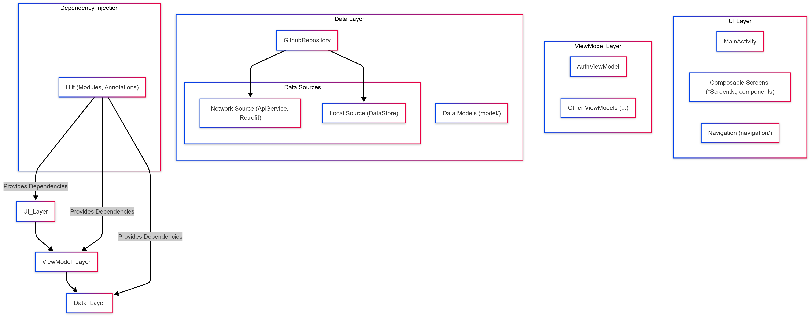
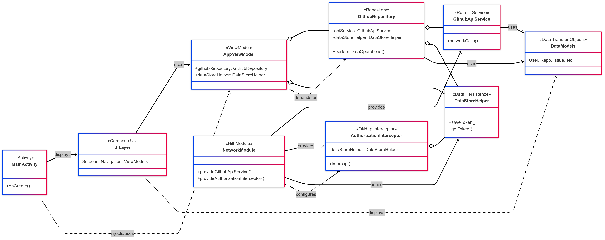
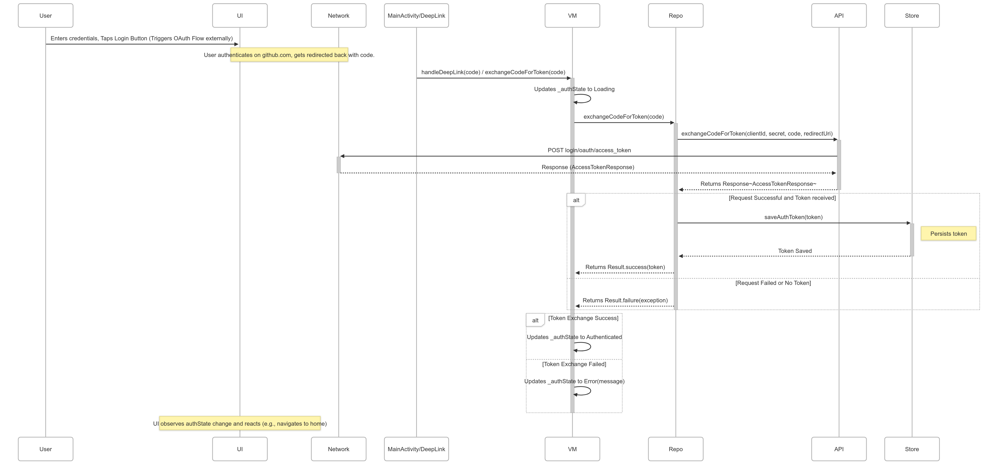

**设计方案：GithubCompose Android 应用**

**1. 概述**

本方案概述了 `GithubCompose` Android 应用的软件架构。该应用利用了现代 Android 开发实践，采用了 Model-View-ViewModel (MVVM) 架构模式，并结合了 Jetpack Compose、用于依赖注入的 Hilt、用于网络请求的 Retrofit 以及 Repository 模式。目标是构建一个可维护、可测试且可扩展的 Github 客户端。

**2. 架构设计**

该应用遵循 MVVM 架构，主要分为以下几层：

*   **UI 层 (View):**
    *   **技术栈:** Jetpack Compose
    *   **职责:** 渲染用户界面，显示 ViewModel 提供的数据，并将用户输入转发给 ViewModel。
    *   **组件:**
        *   `Activity` (`MainActivity`): 托管 Compose UI 并作为应用程序入口点。
        *   `Composable 函数` (`*Screen.kt`, `components/`): 构建声明式 UI 元素。它们通常是无状态的或持有简单的 UI 相关状态。
        *   `导航` (`navigation/`): 管理不同屏幕之间的导航流程（可能使用 Navigation Compose）。
    *   **特性:** UI 层是被动的，观察来自 ViewModel 的状态变化并相应地做出反应。

*   **ViewModel 层:**
    *   **技术栈:** Android ViewModel, Kotlin Coroutines, StateFlow/LiveData
    *   **职责:**
        *   持有和管理与 UI 相关的状态。
        *   处理 UI 事件和用户输入。
        *   调用数据层 (Repository) 来获取或修改数据。
        *   将表示逻辑（或简单的业务逻辑）与 UI 分离。
    *   **组件:** 每个主要功能屏幕通常都有一个对应的 ViewModel (`AuthViewModel`, `PopularViewModel` 等)。
    *   **特性:** ViewModel 具有生命周期感知能力，并在配置更改后存活。Repository 通过 Hilt 注入。

*   **数据层 (Model):**
    *   **技术栈:** Repository Pattern, Retrofit, OkHttp, Gson, Jetpack DataStore, Kotlin Coroutines
    *   **职责:** 提供统一的数据访问接口，抽象化具体的数据源（网络、本地缓存）。处理数据获取、存储和同步逻辑。
    *   **组件:**
        *   `Repository` (`GithubRepository.kt`): 作为 ViewModel 的单一数据来源和入口点。协调从不同来源的数据检索。
        *   `网络数据源` (`GithubApiService`, `NetworkModule`): 使用 Retrofit 和 OkHttp 与 Github API 交互。
        *   `本地数据源` (`DataStoreHelper.kt`): 使用 Jetpack DataStore 存储少量本地数据（例如，身份验证令牌）。
        *   `数据模型` (`model/`): 定义用于网络通信和应用程序内部的数据结构。
    *   **特性:** 数据层对上层（ViewModel）是透明的，上层不需要知道数据是来自网络还是本地存储。

*   **依赖注入:**
    *   **技术栈:** Hilt
    *   **职责:** 管理各种组件之间的依赖关系，简化对象创建和生命周期管理，并增强可测试性。
    *   **组件:** `di/NetworkModule.kt`, `@HiltViewModel`, `@AndroidEntryPoint`, `@Inject` 注解等。

**3. UML 图**

*   **组件图:**

*   **简化类图:**

*   **序列图 (登录流程示例):**

**4. 优势**

*   **关注点分离:** MVVM 清晰地分离了 UI、表示逻辑和数据逻辑，使得代码库更易于理解和管理。
*   **可测试性:** ViewModel 和数据层对 Android 框架 UI 组件的依赖性最小，便于单元测试。Hilt 通过简化依赖管理进一步增强了可测试性。
*   **可维护性:** 分层和模块化的结构减少了耦合，使得修改现有功能或添加新功能更容易，且影响范围更小。
*   **适应性:** 利用 Jetpack Compose 和 Coroutines 等现代技术，提高了开发效率和应用程序性能。

**5. 结论**

`GithubCompose` 应用采用了健壮且成熟的 MVVM 架构，并结合了现代 Android 开发库和最佳实践。这种设计提供了出色的可扩展性、可维护性和可测试性，使其适用于构建功能丰富的客户端应用程序。 