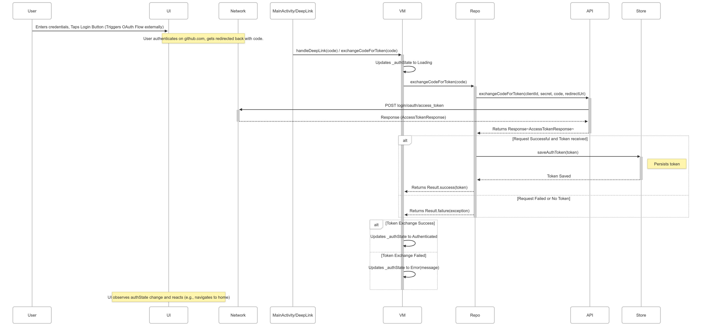

# GithubCompose

一个使用 Jetpack Compose 构建的 Android GitHub 客户端

## 功能列表 (Features)

本应用实现了以下功能：

*   **匿名浏览**: 无需登录即可浏览 GitHub 热门仓库。
*   **仓库详情**: 查看仓库的详细信息（如 Star 数量、描述、语言等）。
*   **仓库搜索**: 根据编程语言搜索仓库，并按 Star 数量排序。
*   **GitHub 登录**: 通过 OAuth 登录您的 GitHub 账号。
*   **个人仓库**: 登录后查看您自己的仓库列表。
*   **认证持久化**: 登录状态在应用重启后保持有效。
*   **提交 Issue**: 对您拥有的仓库提交新的 Issue。
*   **登出**: 退出当前登录的 GitHub 账号。
*   **屏幕旋转**: 支持横屏和竖屏模式。
*   **错误处理**: 对网络请求等场景进行了适当的错误处理。

## 应用截图 (Screenshots)

| 热门与搜索 | 仓库详情 | 个人中心与问题 |
|-----------------|-------------------|------------------|
|  |  |  |
|  |  |  |
|  |  |  |

## 设置 (Setup)

1.  **克隆仓库**:
    ```bash
    git clone https://github.com/YOUR_USERNAME/GithubCompose.git
    cd GithubCompose
    ```
2.  **配置 GitHub OAuth 应用**:
    *   您需要先在 GitHub 上注册一个 OAuth Application。访问 [GitHub Developer Settings](https://github.com/settings/apps) 创建。
    *   设置 `Authorization callback URL` 为 `githubcompose://callback`。
    *   创建完成后，您将获得 `Client ID` 和 `Client Secret`。
3.  **创建 `local.properties`**:
    *   在项目的根目录下创建一个名为 `local.properties` 的文件。
    *   添加您的 GitHub OAuth 应用凭据：
      ```properties
      GITHUB_CLIENT_ID=在此处粘贴您的Client_ID
      GITHUB_SECRET=在此处粘贴您的Client_Secret
      ```

## 构建和运行 (Build and Run)

1.  使用 Android Studio (推荐最新稳定版) 打开项目。
2.  等待 Gradle 同步完成依赖项下载。
3.  选择一个模拟器或连接一个物理设备（需要 Android API Level 29 或更高版本）。
4.  点击 "Run" 按钮编译并运行应用。

## 技术栈 (Tech Stack)

*   **语言**: Kotlin
*   **UI**: Jetpack Compose
*   **架构**: MVVM (Model-View-ViewModel)
*   **核心组件**:
    *   ViewModel
    *   Navigation Component
    *   Coroutines (用于异步处理)
*   **网络**: Retrofit, OkHttp
*   **API**: GitHub REST API v3
*   **认证**: OAuth 2.0
*   **测试框架**:
    *   JUnit 4 (单元测试)
    *   Mockito (Mock 框架)
    *   Espresso (UI 测试)
    *   Compose UI Testing (Compose UI 测试)

## 设计 (Design)

有关应用程序架构的详细信息，请参阅 [设计方案](DESIGN-CN.md)。

### 架构概览

本应用采用 MVVM (Model-View-ViewModel) 架构模式，主要包含以下关键组件：

#### 组件图


#### 类图


#### 登录流程时序图


## 许可证 (License)

```
Copyright 2025 申国骏 Lawrence Shen

Licensed under the Apache License, Version 2.0 (the "License");
you may not use this file except in compliance with the License.
You may obtain a copy of the License at

    http://www.apache.org/licenses/LICENSE-2.0

Unless required by applicable law or agreed to in writing, software
distributed under the License is distributed on an "AS IS" BASIS,
WITHOUT WARRANTIES OR CONDITIONS OF ANY KIND, either express or implied.
See the License for the specific language governing permissions and
limitations under the License.
``` 
